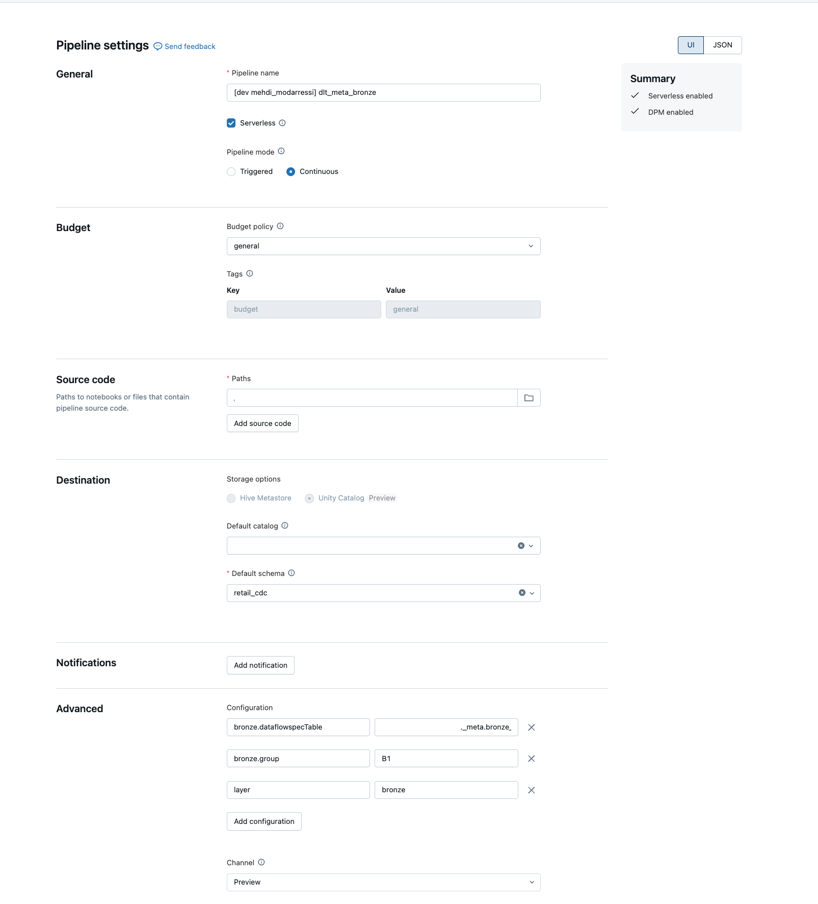
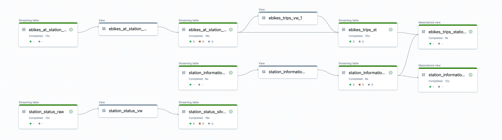
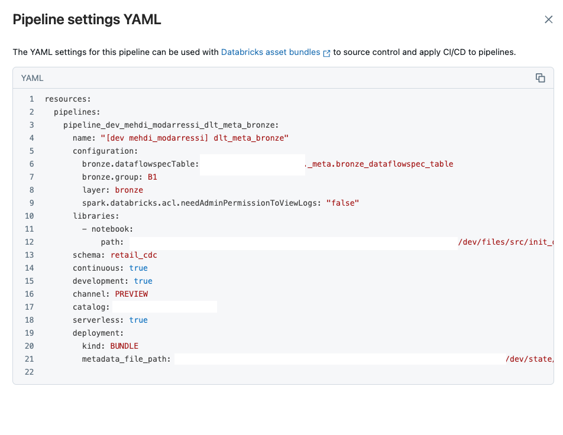

# DLT Meta Lean Framework Documentation

## Table of Contents

- [Overview](#overview)
- [Benefits](#benefits)
- [Dependencies](#dependencies)
- [Architecture](#architecture)
- [Implementation](#implementation)
  - [Example Metadata Population Scripts](#example-metadata-population-scripts)
  - [Metadata Schema](#metadata-schema)
  - [Data Quality Configuration](#data-quality-configuration)
  - [Cloud Files Notification Support](#cloud-files-notification-support)
  - [SCD (Slowly Changing Dimension) Support](#scd-slowly-changing-dimension-support)
  - [High Watermark Tracking](#high-watermark-tracking)
  - [Supported Source Types](#supported-source-types)
  - [Current Feature Support and Limitations](#current-feature-support-and-limitations)
  - [Deployment Structure](#deployment-structure)
- [Getting Started](#getting-started)
- [Common Issues & Solutions](#common-issues--solutions)
- [License](#license)

## Overview

A metadata-driven framework for building [Delta Live Tables (DLT)](https://docs.databricks.com/en/delta-live-tables/index.html) pipelines in Databricks. The framework provides a configurable way to manage data ingestion and transformation pipelines through metadata tables rather than hard-coded pipeline logic.





### Benefits

- Reduced pipeline code duplication
- Centralized pipeline management
- Consistent data quality enforcement
- Flexible configuration without code changes

### Dependencies

- Databricks Runtime
- Delta Live Tables
- PySpark
- Databricks Asset Bunddles (Optional for deployment)

## Architecture

### Core Components

- `DataflowPipeline` - Main pipeline orchestration class
- `PipelineReaders` - Handles reading from different source types
- `DataflowSpec` classes - Define metadata schemas for Bronze and Silver layers

### Pipeline Layers

#### Bronze Layer (Data Ingestion)

Handles raw data ingestion with configurations for:

- Source details and format
- Reader options
- Data quality rules
- CDC settings

#### Silver Layer (Transformations)

Manages data transformations with settings for:

- Source/target mappings
- Column transformations
- Data quality checks
- CDC operations
- Materialized Views
  - Supports materialized views across catalogs/schemas
  - Uses standard SQL syntax
  - For details, see Databricks documentation on [Materialized Views in DLT](https://docs.databricks.com/en/delta-live-tables/index.html#materialized-view) and [Create a Delta Live Tables materialized view](https://docs.databricks.com/en/delta-live-tables/python-ref.html#create-a-delta-live-tables-materialized-view-or-streaming-table)

Benefits of DLT Materialized Views:

- Automatic incremental updates
- Consistent cross-catalog reporting
- Reduced query latency
- Cost-effective computation (only processes changes)
- Built-in recovery and fault tolerance

Example materialized view configuration:

```python
config = {
    "dataFlowId": "product_summary",
    "dataFlowGroup": "REPORTS",
    "materializedView": """
        SELECT 
            c.category_name,
            p.brand,
            COUNT(*) as product_count,
            AVG(p.price) as avg_price,
            SUM(i.quantity) as total_inventory
        FROM catalog1.products.product_details p
        JOIN catalog2.categories.category_lookup c ON p.category_id = c.id
        LEFT JOIN catalog3.inventory.stock i ON p.product_id = i.product_id
        GROUP BY c.category_name, p.brand
    """,
    "targetFormat": "delta",
    "targetDetails": {
        "database": "reporting_catalog.summaries",
        "table": "product_category_summary"
    }
    }
```

### Core Components Details

#### dataflow_pipeline.py

- Pipeline lifecycle management
- Metadata configuration loading
- Layer orchestration (Bronze/Silver)
- Error handling and logging

#### pipeline_readers.py

- Implements source type readers
- Handles cloud files, delta tables
- Configurable read options
- Schema validation

#### dataflow_specs.py

- Metadata schema definitions
- Configuration validation
- Default values handling
- Schema evolution support

### Utility Modules

#### metadata_utils.py

- Metadata CRUD operations
- Version management
- Configuration validation
- Table maintenance

#### quality_utils.py

- Quality rule parsing
- Expectation application
- Quality metrics collection
- Failure handling

#### cdc_utils.py

- CDC pattern detection
- Change application logic
- History tracking
- Merge operation handling

### Job Modules

#### create_md_tables.py

```python
def create_metadata_tables():
    # Creates both Bronze and Silver metadata tables
    # Initializes versioning
    # Sets up table properties
```

#### populate_bronze_job.py

```python
def populate_bronze_metadata():
    # Loads Bronze configurations
    # Validates against schema
    # Inserts/updates metadata records
```

#### populate_silver_job.py

```python
def populate_silver_metadata():
    # Loads Silver configurations
    # Validates transformations
    # Manages view definitions
```

## Implementation

### Example Metadata Population Scripts

The framework includes example scripts for populating metadata tables located in the `examples_populate` directory.
Similar files are also in the main code directory. For every target table the Notebook cell needs to be replicated
and the variables adjusted.

These Notebooks are set up as part of a Databricks Workflow using the `populate_metadata_job.yml`

### Metadata Schema

More detailed information available as inline comments in the Example Notebooks

```sql
-- Common fields
dataFlowId STRING,                    -- Unique identifier
dataFlowGroup STRING,                 -- Logical grouping
sourceFormat STRING,                  -- Source data format
sourceDetails MAP<STRING,STRING>,     -- Source configuration
readerConfigOptions MAP<STRING,STRING>, -- Reader settings
targetFormat STRING,                  -- Target format
targetDetails MAP<STRING,STRING>,     -- Target configuration
tableProperties MAP<STRING,STRING>,   -- Table properties
partitionColumns ARRAY<STRING>,       -- Partitioning columns
liquidClusteringColumns MAP<STROMG,STRING>, -- Liquid Clustering Key Columns
cdcApplyChanges STRING,              -- CDC configuration
dataQualityExpectations STRING,      -- Quality rules
version STRING,                       -- Config version
createDate TIMESTAMP,                -- Creation timestamp
createdBy STRING,                    -- Creator
updateDate TIMESTAMP,                -- Update timestamp
updatedBy STRING                     -- Last updater

-- Layer-specific fields
-- Bronze
cloudFileNotificationsConfig MAP<STRING,STRING>, -- Use CloudFileNotification instead of Directory Listing Mode
highWaterMark MAP < STRING, STRING >, -- Write the High WaterMark Column to Integration Logs Table
schema STRING [TODO]

-- Silver
selectExp ARRAY<STRING>,
whereClause ARRAY<STRING>,
materializedView STRING
```

### Data Quality Configuration

The framework supports various data quality checks through the `dataQualityExpectations` field in metadata. For detailed information about DLT expectations, see [Databricks Data Quality with Delta Live Tables](https://docs.databricks.com/workflows/delta-live-tables/delta-live-tables-expectations.html).

#### Basic Expectations

```python
config = {
    "dataQualityExpectations": {
        "expect_or_fail": {                         # Stop pipeline on violation
            "valid_id": "id IS NOT NULL",
            "valid_date": "date >= '2020-01-01'"
        },
        "expect_or_drop": {                         # Drop invalid records
            "valid_amount": "amount > 0",
            "valid_category": "category IN ('A','B','C')"
        }
    }
}
```

#### Composite Quality Rules

```python
config = {
    "dataQualityExpectations": {
        "expect_or_fail": {
            "valid_customer": """
                customer_id IS NOT NULL AND
                email LIKE '%@%.%' AND
                LENGTH(phone) >= 10
            """,
            "valid_transaction": """
                transaction_date <= CURRENT_TIMESTAMP() AND
                amount BETWEEN 0 AND 1000000 AND
                currency IN ('USD', 'EUR', 'GBP')
            """
        }
    }
}
```

#### Row-Level Quality Metrics

Key Features:

- Three enforcement levels:
  - `expect_or_fail`: Invalid records prevent the update from succeeding. Manual intervention is required before reprocessing. This expectation causes a failure of a single flow and does not cause other flows in your pipeline to fail.
  - `expect_or_drop`: Invalid records are dropped before data is written to the target. The count of dropped records is logged alongside other dataset metrics.
  - `expect_or_warn` : Invalid records are written to the target. The count of valid and invalid records is logged alongside other dataset metrics.
- Support for complex SQL expressions
- Multiple expectations per table
- Quality metrics tracking

[Documentation](https://docs.databricks.com/en/delta-live-tables/expectations.html)

### Cloud Files Notification Support

Prerequisites:

- Azure Key Vault setup for storing credentials
- Service Principal with required permissions
- Storage notification configuration

For detailed setup instructions, see [File Notification Mode Setup](https://learn.microsoft.com/en-us/azure/databricks/ingestion/cloud-object-storage/auto-loader/file-notification-mode).

The framework supports automated ingestion using cloud storage notifications through the `cloudFileNotificationsConfig` option in Bronze metadata. For more details, see [Auto Loader](https://docs.databricks.com/ingestion/auto-loader/index.html) and [Cloud Files Configuration](https://docs.databricks.com/ingestion/auto-loader/options.html).

- Note: This feature in the framework is undergoing changes - Please reach out if you'd need to use it.

```yaml
cloudFileNotificationsConfig:
  cloudProvider: "azure"                # azure, aws, or gcp
  directoryToMonitor: "/data/raw/"      # Source directory path
  filePattern: "*.csv"                  # File matching pattern
  maxFilesPerTrigger: "1000"            # Batch size limit
  useNotifications: "true"              # Enable notification service
  pollingInterval: "10 seconds"         # Check frequency
  maxBytesPerTrigger: "1073741824"      # Batch size in bytes (1GB)
  startingPosition: "latest"            # latest or timestamp
```

Example Bronze metadata configuration with notifications:
-- edit require missing group

```python
config = {
    "dataFlowId": "sales_data",
    "sourceFormat": "cloudFiles",
    "sourceDetails": {
        "path": "Volumes/data",
        "format": "csv"
    },
    "cloudFileNotificationsConfig": {
        "cloudProvider": "azure",
        "directoryToMonitor": "/data/sales/",
        "filePattern": "*.csv",
        "maxFilesPerTrigger": "100",
        "useNotifications": "true"
    },
    "targetFormat": "delta",
    "targetDetails": {
        "path": "Volumes/bronze/sales"
    }
}
```

Key Features:

- Automatic detection of new files
- Configurable batch processing
- Cloud provider-specific optimizations
- Incremental processing support
- Fault-tolerant processing

### SCD (Slowly Changing Dimension) Support

The framework supports different SCD types through the `cdcApplyChanges` configuration in both Bronze and Silver metadata. For implementation details, see:

- [Change Data Capture with Delta Live Tables](https://docs.databricks.com/delta-live-tables/cdc.html)
- [Apply Changes Into Delta Lake](https://docs.databricks.com/delta-live-tables/cdc.html#apply-changes-into-delta-lake)
- [CDC with Auto Loader](https://docs.databricks.com/ingestion/auto-loader/cdc.html)

#### SCD Type 1 (Overwrite)

Useful for:

- Simple dimension updates
- Deduplication of source records (automatically handles duplicates by keeping latest version)
- Systems that send multiple records with same key but different timestamps

```python
config = {
    "dataFlowGroup" : "customers_Bronze",
    "dataFlowId": "customer_dimension",
    "cdcApplyChanges": {
        "scdType": "1",
        "keys": ["customer_id"],          # Records with same key are deduplicated
        "sequence_by": "update_timestamp"   # Latest record wins
    }
}
```

Note: When source systems send duplicate records (same business key but different timestamps),
SCD Type 1 configuration automatically handles deduplication by:

- Identifying records with the same key columns
- Using the `sequenceBy` column to determine the latest version
- Only keeping the most recent record in the target table

#### SCD Type 2 (History Tracking)

```python
config = {
    "dataFlowGroup" : "customers_Bronze",
    "dataFlowId": "customer_dimension",
    "cdcApplyChanges": {
        "scdType": "2",
        "keys": ["customer_id"],                    # Business key columns
        "sequence_by": "operation_date",            # Column for change ordering
        "apply_as_deletes": "operation = 'DELETE'", # Delete condition
        "track_history_except_column_list": [       # Columns to exclude from history tracking
            "file_path",
            "processing_time"
        ],
        "except_column_list": [                     # Columns to exclude from comparison
            "operation"
        ]
    }
}
```

--- edit required
Key SCD Type 2 Configuration Options:

- `scdType`: Set to "2" for historical tracking
- `keys`: Business key columns for record identification
- `sequence_by`: Column used for ordering changes
- `apply_as_deletes`: SQL condition to identify delete operations
- `track_history_except_column_list`: Columns to exclude from version history
- `except_column_list`: Columns to exclude from change detection

### High Watermark Tracking

The framework includes support for high watermark tracking to enable incremental processing and facilitate data lineage tracking through the `set_high_watermark.py` utility.

#### High watermark tracking is essential for

- Efficient incremental data loading
- Preventing data reprocessing
- Tracking progress across pipeline runs
- Ensuring data lineage and traceability
- Supporting audit requirements

#### Configuration

To enable high watermark tracking, include the `highWaterMark` configuration in your metadata:

```python
config = {
    "dataFlowId": "customer_orders",
    "dataFlowGroup": "SALES",
    "sourceFormat": "delta",
    "sourceDetails": {
        "database": "retail_catalog.bronze",
        "table": "customer_orders"
    },
    "highWaterMark": {
        "contract_id": "SALES-ORDERS-001",
        "contract_version": "1.0.0",
        "contract_major_version": "1",
        "watermark_column": "order_timestamp"
    },
    // ...other configuration...
}
```

Key Configuration Elements:

- `contract_id`: Unique identifier for the data contract
- `contract_version`: Version of the data contract (semantic versioning)
- `contract_major_version`: Major version number only
- `watermark_column`: Column used to track processing progress (typically a timestamp or sequential ID)

#### Watermark Tracking Process

The `set_high_watermark.py` utility:

1. Reads the metadata table filtered by dataflow group
2. For each table with high watermark configuration:
   - Uses Delta Change Data Feed to track changes
   - Calculates the maximum watermark value
   - Formats a SQL expression for future incremental loads
   - Stores results in a central integration logs table

The integration logs table maintains:

- Current watermark values per contract
- Table lineage information
- Source file tracking
- Processing timestamps

#### Usage in Incremental Loading

Once watermarks are set, they can be used in subsequent pipeline runs:

```python
# Example of using stored watermark for incremental loading
watermark = spark.sql(f"""
    SELECT watermark_next_value 
    FROM {meta_catalog}.{meta_schema}.{integration_logs_table}
    WHERE contract_id = 'SALES-ORDERS-001'
""").collect()[0][0]

# Apply the watermark filter to source data
filtered_data = source_df.filter(expr(watermark))
```

#### Implementation Notes

- Watermark tracking runs as a separate process after table updates complete
- Uses foreachBatch for reliable upsert operations
- Supports both streaming and batch processing models
- Creates checkpoints to ensure fault tolerance

For detailed implementation, see the `set_high_watermark.py` script in the framework's source code.

### Supported Source Types

The framework supports multiple source formats as well as `cloudFiles` through the `sourceFormat` configuration:

#### Delta Tables

```python
config = {
    "dataFlowId": "customers",
    "sourceFormat": "delta",
    "sourceDetails": {
        "database": "retail_catalog.bronze",
        "table": "customers"
    },
    "readerConfigOptions": {
        "readChangeFeed": "true",
        "startingVersion": "latest"
    }
}
```

#### JDBC Sources

```python
config = {
    "dataFlowId": "oracle_products",
    "sourceFormat": "jdbc",
    "sourceDetails": {
        "url": "jdbc:oracle:thin:@//host:port/service",
        "dbtable": "PRODUCTS",
        "user": "${secrets/scope/username}",
        "password": "${secrets/scope/password}"
    },
    "readerConfigOptions": {
        "fetchsize": "10000",
        "numPartitions": "4",
        "partitionColumn": "PRODUCT_ID",
        "lowerBound": "0",
        "upperBound": "1000000"
    }
}
```

#### Kafka Streams

```python
config = {
    "dataFlowId": "kafka_orders",
    "sourceFormat": "kafka",
    "sourceDetails": {
        "kafka.bootstrap.servers": "host:9092",
        "subscribe": "orders_topic",
        "startingOffsets": "latest"
    },
    "readerConfigOptions": {
        "failOnDataLoss": "false",
        "maxOffsetsPerTrigger": "10000"
    }
}
```

#### Azure Event Hubs

```python
config = {
    "dataFlowId": "eventhub_telemetry",
    "sourceFormat": "eventhubs",
    "sourceDetails": {
        "eventHubName": "telemetry",
        "connectionString": "${secrets/scope/eventhub_connection}"
    },
    "readerConfigOptions": {
        "maxEventsPerTrigger": "5000",
        "startingPosition": {
            "offset": "-1",
            "seqNo": -1,
            "enqueuedTime": "2023-01-01T00:00:00.000Z"
        }
    }
}
```

Key Configuration Points:

- Each source type has specific required parameters
- Credentials should use Databricks secrets
- Streaming sources support checkpointing
- Connection parameters can be environment-specific
- Reader options control performance and behavior

### Current Feature Support and Limitations

#### Schema Management

- The framework requires separate schemas for Bronze and Silver layers
- Each pipeline operates within its own schema namespace
- Schema layout example:

```DIR
  catalog_name
  ├── bronze_schema
  │   ├── raw_table1
  │   └── raw_table2
  └── silver_schema
      ├── transformed_table1
      └── transformed_table2
  ```

- Cross-schema references must be fully qualified

#### DLT Features Support

- ✅ Single Catalog and Schema per pipeline
- ✅ Unity Catalog Integration
- ✅ Expectations and Quality Metrics
- ✅ Auto Loader and CDC
- ✅ Gold Layer support through Materialized Views using SQL (Python Coming Soon ✨🆕 )
- ✅ Liquid Clustering With Manual Key 🗝️ Selection Only (🚫 DLT Does Not Support AUTO Liquid Cluster)
- ❌ Direct Publishing Mode Not Supported (Private Preview ✨🆕)
  - The framework currently does not support Direct Publishing Mode for Streaming Tables which allows multi catalog and schema writes (Coming Soon ✨🆕 )
  - Will be implemented once the feature becomes Generally Available
  - Existing pipelines use classic DLT execution model

- ✅ High Water Mark From Bronze Tables For Ingestion
- 🆕䷾ Support for Complex JSON (Coming Soon ✨🆕)

### Deployment Structure

```yaml
.
├── resources/                      # Pipeline definitions
│   ├── dlt_meta_bronze.yml         # Bronze pipeline config  
│   └── populate_metadata.yml       # Metadata job config
├── src/                            # Source code
└── databricks.yml                  # Bundle configuration
```

## Getting Started

### Option 1: Deployment via Databricks Asset Bundles (Recommended)

1. **Configure Pipeline-Specific YAMLs**

```yaml
# resources/bronze_pipeline.yml
resources:
  pipelines:
    dlt_meta_bronze:
      name: "${bundle.name}-bronze"
      target: "${METADATA_CATALOG}.${METADATA_SCHEMA}"
      paths:
        - pipeline/bronze_pipeline.py
      configuration:
        metadata_table: "bronze_metadata"
        layer: "bronze"
        bronze.group: "raw_data"
      clusters:
        - label: "default"
          autoscale:
            min_workers: 1
            max_workers: 4
          node_type_id: "${WORKER_NODE_TYPE}"

# resources/silver_pipeline.yml
resources:
  pipelines:
    dlt_meta_silver:
      name: "${bundle.name}-silver"
      target: "${METADATA_CATALOG}.${METADATA_SCHEMA}"
      paths:
        - pipeline/silver_pipeline.py
      configuration:
        metadata_table: "silver_metadata"
        layer: "silver"
        silver.group: "transformed_data"
      depends_on:
        - pipelines.dlt_meta_bronze

# databricks.yml (root bundle configuration)
bundle:
  name: "dlt-meta-framework"
  
includes:
  - resources/bronze_pipeline.yml
  - resources/silver_pipeline.yml

targets:
  dev:
    default: true
    workspace:
      host: "${DATABRICKS_HOST}"
    properties:
      METADATA_CATALOG: "dev_catalog"
      METADATA_SCHEMA: "dlt_meta"
      WORKER_NODE_TYPE: "Standard_DS3_v2"
  
  prod:
    workspace:
      host: "${DATABRICKS_PROD_HOST}"
    properties:
      METADATA_CATALOG: "prod_catalog"
      METADATA_SCHEMA: "dlt_meta"
      WORKER_NODE_TYPE: "Standard_DS4_v2"
```

Benefits of separate pipeline YAMLs:

- Independent pipeline configurations
- Environment-specific settings
- Clearer dependency management
- Easier maintenance and versioning
- Modular deployment options

2. **Set Environment Variables**

```bash
# .env.dev
METADATA_CATALOG=dev_catalog
METADATA_SCHEMA=dlt_meta

# .env.prod
METADATA_CATALOG=prod_catalog
METADATA_SCHEMA=dlt_meta
```

3. **Deploy Bundle**

```bash
databricks bundle deploy --environment dev
```

### Option 2: Manual Deployment

1. **Repository Setup**

```bash
git clone https://github.com/your-org/dlt-meta-framework.git
cd dlt-meta-framework
pip install -r requirements.txt
```

2. **Create Metadata Tables**

```python
# Using Databricks notebook
%run ./jobs/create_md_tables $catalog $schema
```

3. **Populate Metadata**

```python
# Example Bronze configuration
from utils.metadata_utils import populate_bronze_metadata

config = {
    "dataFlowId": "customer_data",
    "sourceFormat": "cloudFiles",
    "sourceDetails": {
        "path": "abfss://container@storage/data",
        "format": "csv"
    }
    # ...other configuration...
}

populate_bronze_metadata(config)
```

4. **Create Pipeline**

```sql
CREATE PIPELINE customer_ingestion
CONFIGURATION (
    'metadata.table' = '${catalog}.${schema}.bronze_metadata',
    'layer' = 'bronze'
)
AS 
%run ./pipeline/init_dlt_meta_pipeline
```

5. **Configure Pipeline Settings**

- Set pipeline parameters:
  - `metadata.table`: Location of metadata table
  - `layer`: Pipeline layer (bronze/silver)
  - `bronze.group`: Dataflow group for filtering
  - `bronze.dataflowIds`: Optional specific dataflow IDs
  - `catalog`: Target catalog for tables
  - `schema`: Target schema for tables
  - `spark.databricks.delta.schema.autoMerge.enabled`: Enable schema evolution
  - `spark.databricks.delta.properties.defaults.autoOptimize.optimizeWrite`: Enable auto optimize
  - `spark.databricks.delta.properties.defaults.autoOptimize.autoCompact`: Enable auto compact
  - `spark.databricks.delta.merge.repartitionBeforeWrite.enabled`: Enable merge optimization
- Set cluster configuration
- Enable Unity Catalog
- Configure auto-scaling
- Set pipeline mode (continuous/triggered)

### Post-Deployment Steps

1. **Verify Metadata Tables**

```sql
SELECT * FROM ${catalog}.${schema}.bronze_metadata
SELECT * FROM ${catalog}.${schema}.silver_metadata
```

2. **Monitor Pipeline**

- Check pipeline status in Databricks Workflows
- Review execution logs
- Monitor data quality metrics

3. **Update Configurations**

- Use metadata management notebooks for updates
- Version control your configurations
- Test in development environment first

### Common Issues & Solutions

- **Permission Issues**: Ensure Unity Catalog permissions are properly set
- **Schema Errors**: Validate metadata against schema definitions
- **CDC Conflicts**: Check CDC configuration alignment
- **Resource Limits**: Adjust cluster configurations as needed

## License

Apache License 2.0
